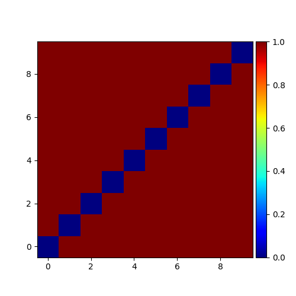
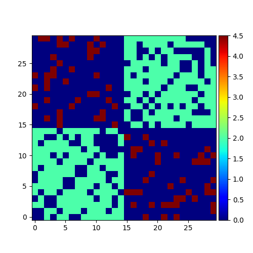
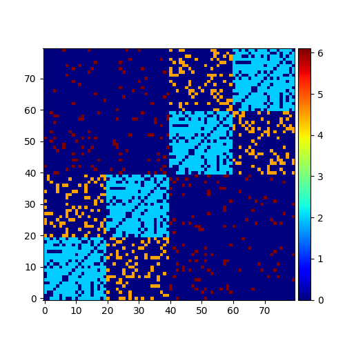

itng toolbox tutorials
================================

This is a short description about how to use itng toolbox.

Graph generator
*******************************

:py:func:`networks.Generators.complete_graph`
-----------------------------------------------------------------------

.. code-block:: python
   
   import itng
   from itng import networks
   import networkx as nx
   from itng.drawing import Drawing

   g = itng.networks.Generators()
   G = g.complete_graph(10)
   Drawing.plot_adjacency_matrix(G,
                                 fileName="complete_graph.png",
                                 cmap="jet")

:py:func:`networks.Generators.modular_graph`
---------------------------------------------------------------------

.. code-block:: python
   
   G = g.modular_graph(30, 0.7, 0.2, [15] * 2, 2.0, 4.5)
   Drawing.plot_adjacency_matrix(G,fileName="modular.png", cmap="jet")

:py:func:`networks.Generators.hierarchical_modular_graph`
------------------------------------------------------------------------

.. code-block:: python
   
   G = g.hierarchical_modular_graph(20, 3, 0.8, 0.25, 1.0, [2.0, 4.5, 6.1])
   Drawing.plot_adjacency_matrix(G, fileName="hmn.png", cmap="jet")
   print (nx.info(G))

   # output
   # Name: 
   # Type: Graph
   # Number of nodes: 80
   # Number of edges: 886
   # Average degree:  22.1500

